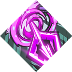

<!-- end front matter -->
# BowRandomExplosionTrait

## Helptext
> **Firework Stance**
> 
> Holding **Attack** creates miniblasts nearby that deal **30** damage.

## My Two Cents
> a firework-themed daedalus upgrade for the bow. sweet!

## Notes
* **Source:** Daedalus
* **Functional:** presumably
* **See Also:** [`LimitedTimeTrait`](LimitedTimeTrait.md)

---